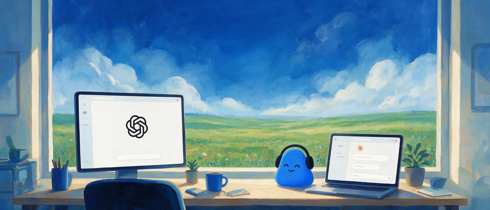

# Meeting.ai MCP Server

Let ChatGPT, Claude, or any AI agent hear your meetings as they happen, so every task you
hand off already has the full context.



Meeting.ai is the AI that works before, during, and after your meeting. It prepares decks and
research before, records and writes the notes during, and turns what was actually said into
minutes, documents, spreadsheets, follow-up decks, audio briefs, and Visual Notes after.

The Meeting.ai MCP server brings that into the AI assistant you already use. Connect it once
and your assistant can record your meetings, read and edit the notes, combine meetings into
recaps, export, share, and create Visual Notes, all inside your own Meeting.ai account.

**Server URL:** `https://mcp.meeting.ai/mcp`

Authentication is OAuth through Meeting.ai's own login. There is no API key. Sign in with the
account you use for the Meeting.ai app, approve the connection, and revoke it any time from
Connected Apps in the Meeting.ai web app. If you do not have an account yet, create one at
[meeting.ai](https://meeting.ai).

## Connect

### Claude

**Claude Code and Cowork.** Use the Meeting.ai plugin. It points Claude at this server and
adds skills that teach Claude how to record meetings, edit notes, and make Visual Notes well.
Install and setup steps are in the plugin repository:
[meeting-ai/memo-claude-plugin](https://github.com/meeting-ai/memo-claude-plugin).

If you prefer to add the server directly in Claude Code without the plugin:

```
claude mcp add --transport http meeting-ai https://mcp.meeting.ai/mcp
```

Then run `/mcp` inside Claude Code, pick `meeting-ai`, and choose **Authenticate**.

**Claude.ai and Claude Desktop.** Open **Settings → Connectors**, choose **Add custom
connector**, enter `https://mcp.meeting.ai/mcp`, and sign in when prompted.

### ChatGPT

1. Open **Settings → Apps & Connectors**.
2. Under **Advanced settings**, turn on **Developer mode**.
3. Choose **Create**, give the connector a name such as `Meeting.ai`, and enter
   `https://mcp.meeting.ai/mcp` as the MCP server URL.
4. Leave authentication on **OAuth**, save, and sign in to Meeting.ai when prompted.

Turn the connector on in a chat from the **+** menu, then ask about your meetings.

### Codex

Add the server:

```bash
codex mcp add meeting-ai --url https://mcp.meeting.ai/mcp
```

Codex opens Meeting.ai in your browser so you can sign in and approve the connection. If the
browser does not open, or you need to sign in again later, run:

```bash
codex mcp login meeting-ai
```

Once approved, the tools are available in every Codex session. `codex mcp list` shows the
connection with `OAuth` in the Auth column.

## Try it

Once connected, ask in plain words. Three to start with:

> Join my Google Meet and take notes: https://meet.google.com/abc-defg-hij

> Recap all my Acme meetings from September into one summary: decisions, open questions, and action items with owners.

> Turn my Q3 planning meeting into a one-page Visual Note.

Some actions, such as recording, exporting, Visual Notes, and media generation, use your
Meeting.ai subscription or coins. If your account has no active subscription or coins, the
assistant tells you and stops.

## Links

- Connection guide, for Claude and other assistants: https://meeting.ai/mcp
- Claude plugin: https://github.com/meeting-ai/memo-claude-plugin
- Website: https://meeting.ai
- Privacy policy: https://meeting.ai/privacy
- Terms of service: https://meeting.ai/terms
- Support: support@meeting.ai

## License

Apache License 2.0. See [LICENSE](LICENSE). The Meeting.ai name, logo, and artwork are trademarks
of Meeting.ai and are not covered by the license; see [NOTICE](NOTICE).
